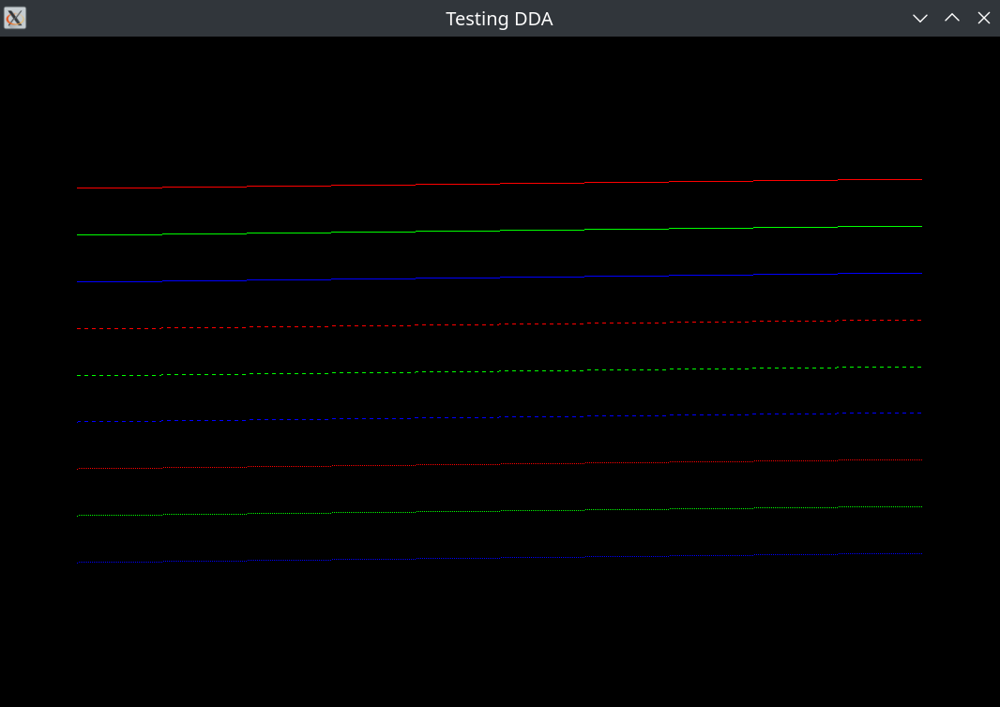
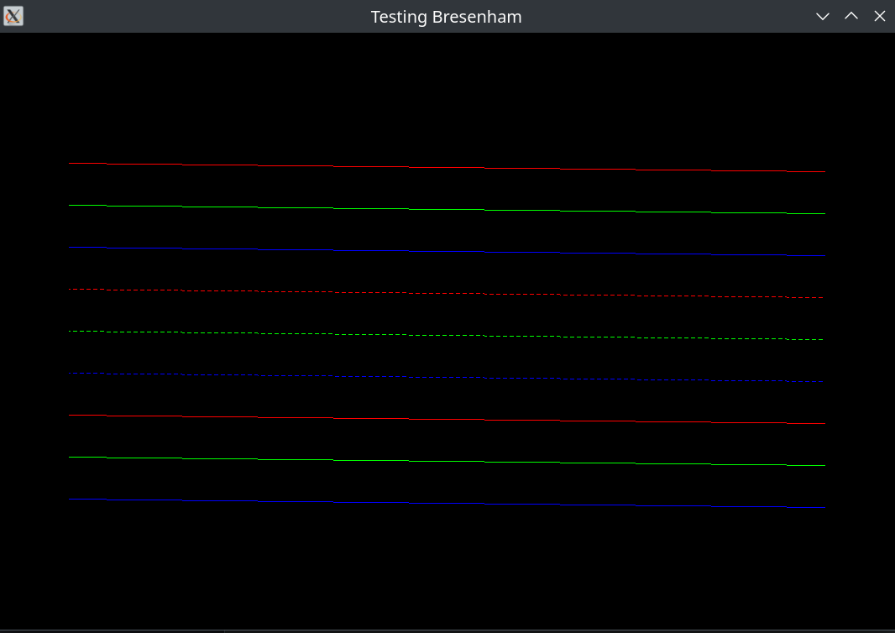
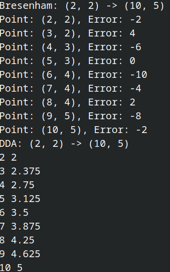
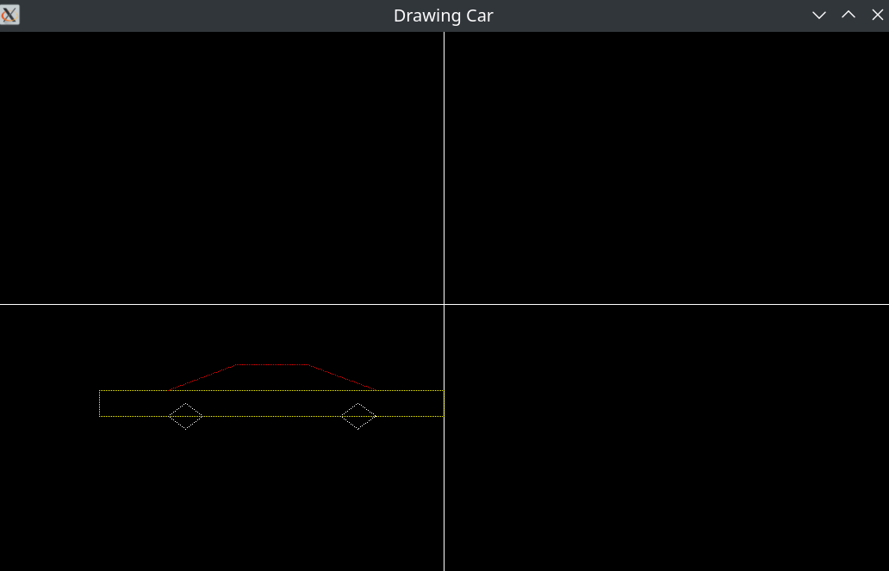
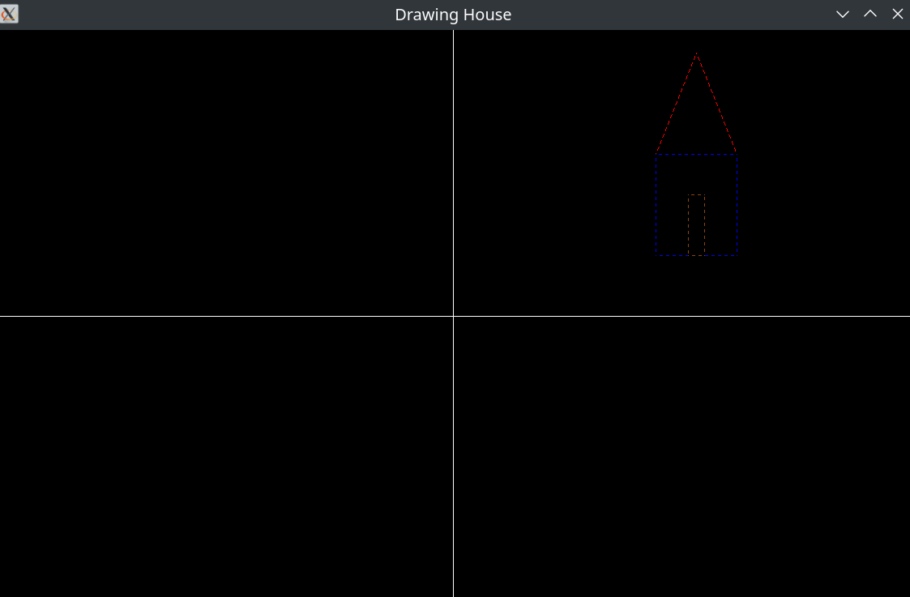

# Visualization of Line Drawing Algorithms: DDA and Bresenham Implementation in OpenGL


By @ShinjiMC - Braulio Nayap Maldonado Casilla

## Introduction

This project demonstrates the implementation of two fundamental line drawing algorithms: Digital Differential Analyzer (DDA) and Bresenham's line algorithm, using OpenGL. It allows users to visualize how these algorithms render lines on the screen with various styles.

## Compilation Instructions

To compile the project, follow these steps:

```bash
mkdir build
cd build
cmake ..
make
```

## Execution Instructions

Once compiled, you can execute the program with various commands:

### 1. DDA Test

```bash
./Drawing testDDA
```

This command renders a series of horizontal lines using the DDA algorithm in different styles (solid, dashed, dotted). Each line is drawn in a distinct color, providing a visual comparison of line styles. The output window will display these lines centered around the origin.



### 2. Bresenham Test

```bash
./Drawing testBresenham
```

This command executes the Bresenham line algorithm to draw the same set of horizontal lines as in the DDA test. Similar to the previous command, the lines will be drawn in different styles, showcasing the differences in rendering between the two algorithms. The output will also be centered around the origin.



### 3. Comparison Test

```bash
./Drawing compare
```

This command runs a comparison between the DDA and Bresenham algorithms. It prints the points generated by both algorithms for the same line, allowing for direct visualization of their differences in output. The resulting lines will be displayed on the same canvas, providing a clear side-by-side comparison.



### 4. Draw Car

```bash
./Drawing car x y width height style styleDraw
```

This command draws a car shape at the specified coordinates (`x`, `y`) with the given width and height. The lines will be rendered using the DDA algorithm in a dotted style. The parameters are:

- `x`: X-coordinate of the car's position
- `y`: Y-coordinate of the car's position
- `width`: Width of the car
- `height`: Height of the car
- `style`: Line style (options: solid, dotted, dashed)
- `styleDraw`: Drawing algorithm (options: DDA or Bresenham)

```bash
./Drawing car -200 -100 400 150 dotted DDA
```



### 5. Draw House

```bash
./Drawing house x y width height style styleDraw
```

This command draws a house shape using the Bresenham algorithm at the specified coordinates. The parameters are:

- `x`: X-coordinate of the house's position
- `y`: Y-coordinate of the house's position
- `width`: Width of the house
- `height`: Height of the house
- `style`: Line style (options: solid, dotted, dashed)
- `styleDraw`: Drawing algorithm (options: DDA or Bresenham)

```bash
./Drawing house 300 200 100 250 dashed Bresenham
```



## License:

This project is licensed under [Creative Commons Atribución-NoComercial-CompartirIgual 4.0 Internacional](http://creativecommons.org/licenses/by-nc-sa/4.0/):

<a rel="license" href="http://creativecommons.org/licenses/by-nc-sa/4.0/">
  
</a>
